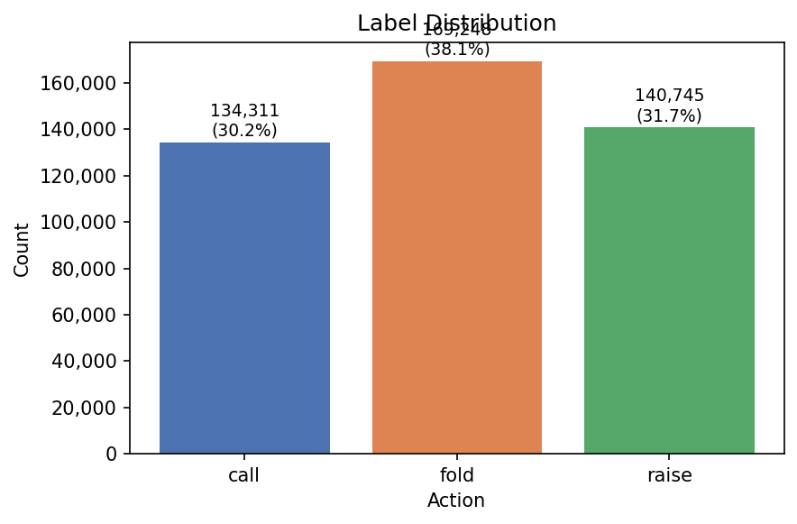
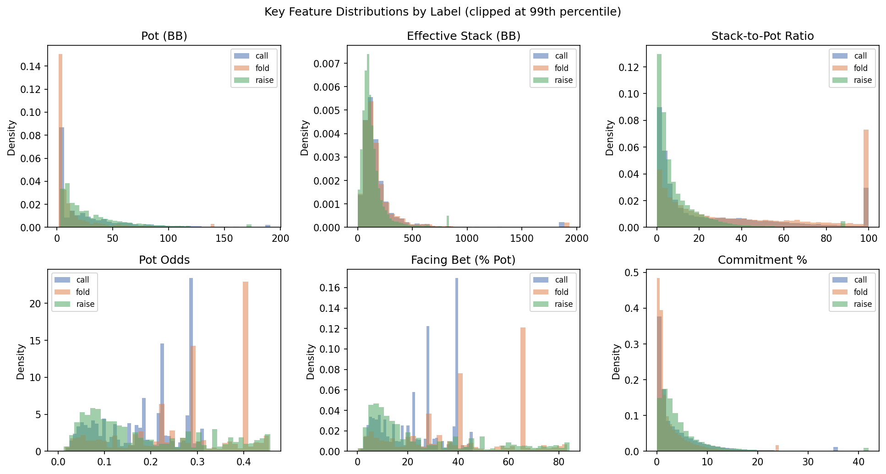
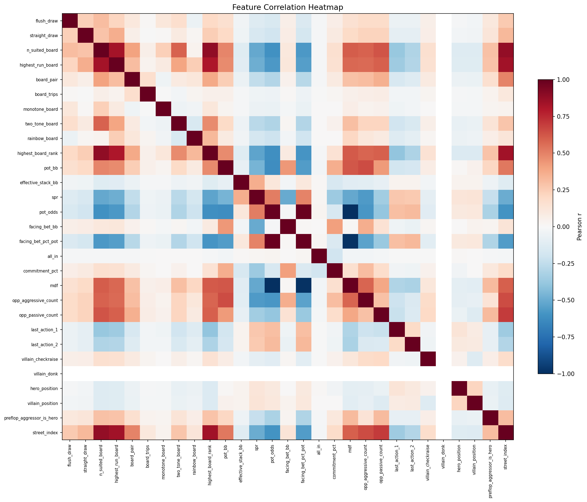
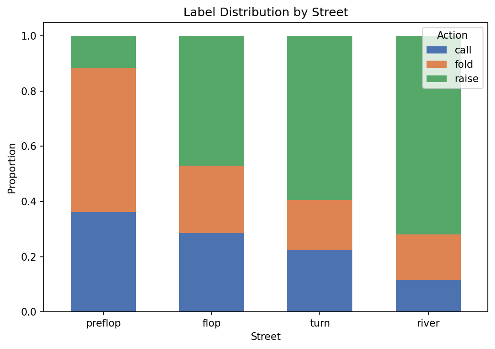
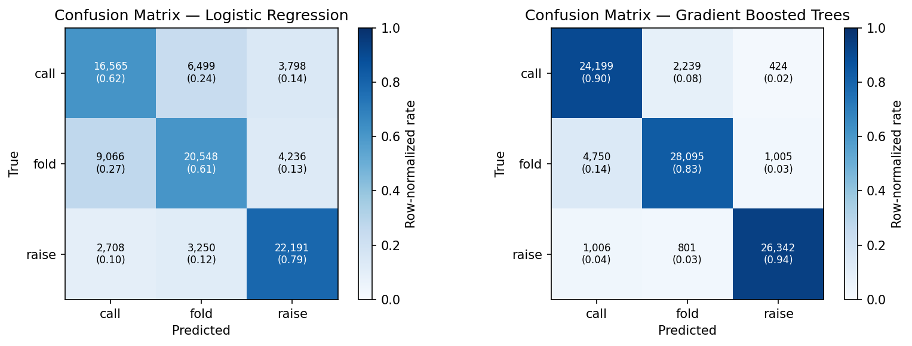
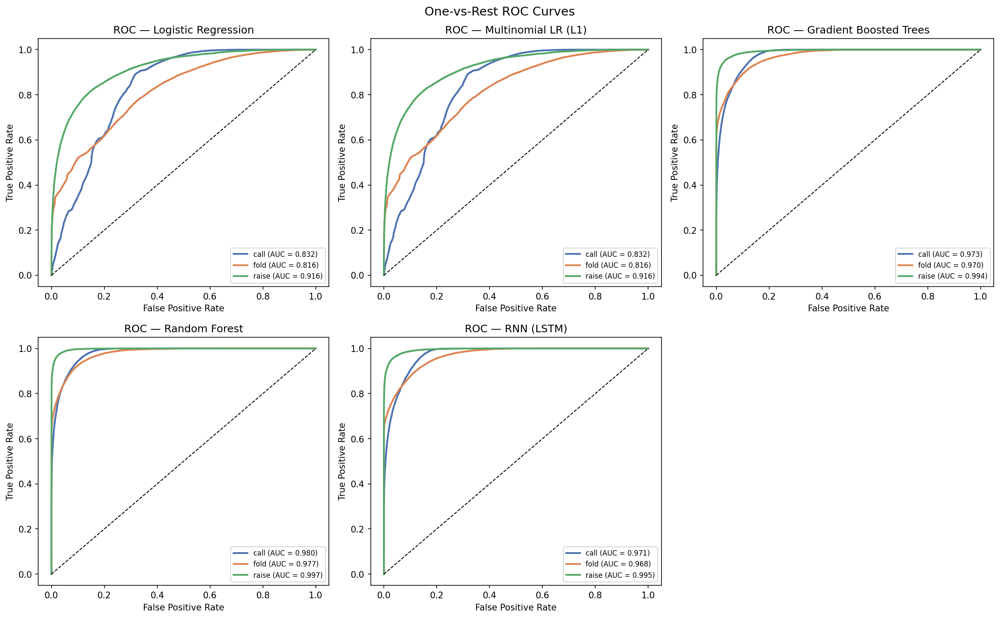
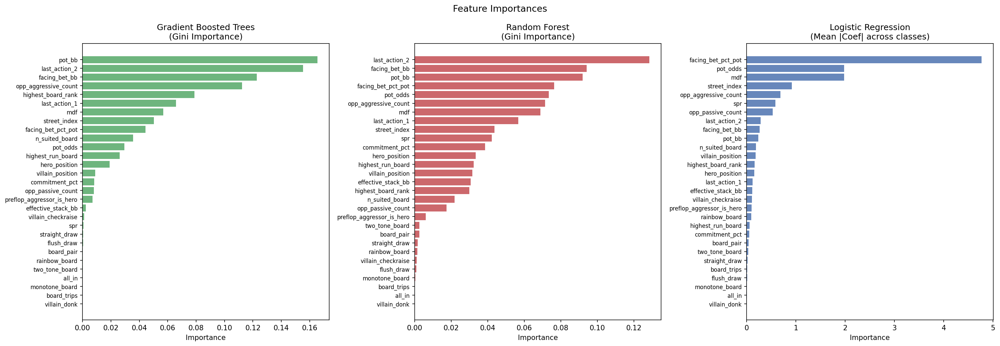

# DS 4400: Machine Learning and Data Mining I — Spring 2026  

**Project Title:** Modeling and Predicting Player Actions in Low-Stakes Poker  

**Team Members:** Luca Miniati, Chigozirim Ike  

**Link to code:** https://github.com/luca-miniati/ds4400/tree/main/final

**Include link to video recording:** *(fill in)*  

---

## 1. Problem Description

How do people play No-Limit Texas Hold'em (NLH)? What motivates their choices of actions? Given information about the current game state—hand strength indicators, position, pot size, stack depth, board texture, and action history—the goal is to predict a player's next action as one of **fold**, **call**, or **raise**.

From a machine learning perspective, poker provides a rich, noisy, and strategic environment with imperfect information, making it a strong testbed for classification models. Accurate models of low-stakes player behavior can be used to study common strategic mistakes, build exploitative agents, and better understand human decision patterns under uncertainty. Low-stakes games are especially interesting because players often follow simple or inconsistent heuristics, which allows comparison between linear and highly flexible models.

---

## 2. Dataset and Exploratory Data Analysis

### Data Source and Pipeline

- **Source:** IRC Poker Database (https://poker.cs.ualberta.ca/IRC/IRCdata.tgz)
- **Pipeline:** IRC hand history files are converted to JSON files and PHH (Poker Hand History) files via `run_pipeline.py`. Feature extraction is performed by `scripts/extract_features.py`, which outputs decision points with 29 features to CSV suitable for training models.
- **Format:** Each row is a **decision point** (a moment when a player faces a fold/call/raise choice). Features represent the full game state visible to the player at that moment, including public information (board cards, pot size, action history) and private information (hole cards, when available from showdown data).

### Dataset Summary

| Metric | Value |
|--------|-------|
| **Total samples** | 444,304 decision points |
| **Features** | 29 numeric features |
| **Labels** | fold, call, raise (3 classes) |

### Label Distribution

| Label | Count | Proportion |
|-------|-------|------------|
| fold | 169,248 | ~38.1% |
| raise | 140,745 | ~31.7% |
| call | 134,311 | ~30.2% |

The classes are reasonably balanced, which is suitable for multi-class classification without heavy class-weighting.

### Feature Representation and Selection

Features are organized into five groups:

1. **Draw (2):** `flush_draw`, `straight_draw` — require hole cards; use -1 when unknown (e.g., no showdown). ~307,545 rows have unknown draw features (preflop or non-showdown).
2. **Board texture (8):** `n_suited_board`, `highest_run_board`, `board_pair`, `board_trips`, `monotone_board`, `two_tone_board`, `rainbow_board`, `highest_board_rank`
3. **Pot/betting (9):** `pot_bb`, `effective_stack_bb`, `spr`, `pot_odds`, `facing_bet_bb`, `facing_bet_pct_pot`, `all_in`, `commitment_pct`, `mdf`
4. **Action (6):** `opp_aggressive_count`, `opp_passive_count`, `last_action_1`, `last_action_2`, `villain_checkraise`, `villain_donk`
5. **Game state (4):** `hero_position`, `villain_position`, `preflop_aggressor_is_hero`, `street_index`

**Preprocessing:** Unknown draw and rank values (-1) are imputed to 0 for training. Missing values are filled with 0. Standard scaling is applied for Logistic Regression; Gradient Boosted Trees use raw features.

### Visualizations

Generate all figures below by running:

```bash
.venv/bin/python scripts/visualize.py
```

Figures are saved to `data/out/figures/`.

#### Label Distribution



The three classes are reasonably balanced: fold is the most common (38.1%), followed by raise (31.7%) and call (30.2%). The slight fold majority is expected, since when a player bets or raises, many opponents fold rather than continue.

#### Feature Distributions by Label



Several features separate the classes clearly:

- **Pot (BB):** Right-skewed with most pots below 50 BB. Raises are overrepresented in larger pots, since players fight harder for the bigger pots.
- **Effective Stack (BB):** Right-skewed. This indicates that the dataset contains samples from extremely deep-stacked hands (> 300BB). This may introduce some noise, since theoretically, deep-stacked cash game strategy should be quite different from that of shallow-stacked cash games.
- **SPR (Stack-to-Pot Ratio):** Concentrates near 0–10. Raises and Folds cluster at higher SPR.
- **Pot Odds:** Multi-modal, since people tend to use the same common bet sizes (1/4, 1/3, 1/2, 2/3 pot).
- **Facing Bet (% Pot):** Folds happen frequently against large bet fractions, Calls and Raises show up more in smaller-bet spots.
- **Commitment %:** Folds cluster at low commitment. This reflects the "fit-or-fold" tendency of players. That is, when players don't hit anything on the board, they will fold near 100% of the time without considering the possibility of bluffing.

#### Feature Correlation Heatmap



Notable correlations:

- **`pot_bb` and `facing_bet_bb`** are strongly positively correlated (bigger pots have bigger absolute bets).
- **`spr` and `pot_bb`** are negatively correlated (a larger pot means a lower stack-to-pot ratio given fixed stacks).
- **`pot_odds` and `mdf`** are perfectly negatively correlated, as expected from their definitions: MDF = 1 − pot_odds.
- **`last_action_1` and `last_action_2`** are positively correlated, showing that action tendencies carry across streets.
- Position features (`hero_position`, `villain_position`) are largely independent of pot/betting features. This is quite interesting, since in high-stakes games, position is the single biggest motivator of action in aggregate.

#### Street-Wise Label Distribution



The action distribution shifts substantially across streets:

- **Preflop:** Most players who face a preflop raise simply fold, reflecting tight preflop ranges in this player pool.
- **Flop–Turn:** As the hand progresses, raise frequency increases and calls decrease. This is consistent with a "pot is worth winning" effect: players who reached later streets with strong hands become more aggressive.
- **River:** Raise is the dominant action (~72%), with call and fold both small. This counterintuitive result likely reflects a polarization effect in the data. Players who bet the river in this dataset tend to face either a fold or a re-raise, with passive calls being relatively rare in these hand histories.

Run `scripts/describe_features.py data/out/decisions.csv` for full summary statistics.

### Dataset Setup

**Step 1: Create the virtual environment and install dependencies:**

```bash
cd final/
python -m venv .venv
source .venv/bin/activate
pip install -r requirements.txt
```

**Step 2: Download the IRC Poker Database:**

```bash
mkdir -p data/IRCdata
cd data/IRCdata
curl -O https://poker.cs.ualberta.ca/IRC/IRCdata.tgz
tar -xzf IRCdata.tgz
cd ../..
```

The extracted archive should contain directories named `holdem1/`, `holdem2/`, `holdem3/` (No-Limit Hold'em), each with monthly subdirectories (`YYYYMM/`) that contain `hdb`, `hroster`, and `pdb/` files.

**Step 3: Convert IRC hand histories to PHH format:**

```bash
.venv/bin/python scripts/run_pipeline.py data/IRCdata -o data/phh
```

This reads all NLH hands from `data/IRCdata/`, exports parsed hand data to `data/phh/json/`, and converts them to PokerKit PHH format at `data/phh/phh/`.

**Step 4: Extract ML features to CSV:**

```bash
.venv/bin/python scripts/extract_features.py
```

This reads all `.phhs` files from `data/phh/phh/` and all `.json` files from `data/phh/json/`, and extracts all decision points. These decision points are written to `data/out/decisions.csv`. For the full dataset, this takes several minutes and produces ~444K rows.

**Step 5: Train models:**

```bash
.venv/bin/python scripts/train_models.py
```

Outputs `data/out/metrics.json` with F1 scores and confusion matrices, and prints classification reports to `data/out/train.log`.

**Step 6: Generate visualizations:**

```bash
.venv/bin/python scripts/visualize.py
```

Saves all figures to `data/out/figures/`. Pass `--skip-models` to only generate dataset plots (faster), or `-l N` to use a row limit.

---

## 3. Approach and Methodology

### Models Trained

1. **Logistic Regression**: Multinomial via `sklearn.linear_model.LogisticRegression` with L-BFGS solver, max_iter=1000. Inputs are StandardScaler-normalized.
2. **Gradient Boosted Trees**: `sklearn.ensemble.GradientBoostingClassifier` with 100 estimators, max_depth=6, learning_rate=0.1.

### Methodology

- **Train/test split:** 80/20 with stratification by label, `random_state=42`
- **Cross-validation:** Not yet used; can be added for more robust model comparison
- **Evaluation metrics:** F1 (macro and weighted), confusion matrix, per-class precision/recall

### Training Command

```bash
.venv/bin/python scripts/train_models.py
```

---

## 4. Metrics

### Summary (from `data/out/metrics.json`)

| Model | F1 (macro) | F1 (weighted) |
|-------|------------|---------------|
| Logistic Regression | 0.6670 | 0.6663 |
| Gradient Boosted Trees | **0.8862** | **0.8853** |



### Classification Reports (test set, `n=88,861`)

**Logistic Regression:**

| Class | Precision | Recall | F1-Score | Support |
|-------|-----------|--------|----------|---------|
| call | 0.58 | 0.62 | 0.60 | 26,862 |
| fold | 0.68 | 0.61 | 0.64 | 33,850 |
| raise | 0.73 | 0.79 | 0.76 | 28,149 |
| **accuracy** | | | **0.67** | 88,861 |

**Gradient Boosted Trees:**

| Class | Precision | Recall | F1-Score | Support |
|-------|-----------|--------|----------|---------|
| call | 0.81 | 0.90 | 0.85 | 26,862 |
| fold | 0.90 | 0.83 | 0.86 | 33,850 |
| raise | 0.95 | 0.94 | 0.94 | 28,149 |
| **accuracy** | | | **0.88** | 88,861 |

### ROC Curves

One-vs-rest ROC curves for each class (call, fold, raise):



| Model | AUC (call) | AUC (fold) | AUC (raise) |
|-------|-----------|-----------|------------|
| Logistic Regression | 0.832 | 0.816 | 0.916 |
| Gradient Boosted Trees | **0.973** | **0.970** | **0.994** |

GBT achieves near-perfect AUC for raise (0.994). This shows that raise decisions are the most predictable, because players nearly always raise with strong made hands or draws in favorable positions. The fold/call boundary is harder for both models (lowest AUC per class).

---

## 5. Discussion and Result Interpretation

### Why Gradient Boosted Trees Outperform Logistic Regression

- **Nonlinearity:** GBT captures nonlinear interactions that a linear model cannot.
- **Feature combinations:** Board texture, pot odds, and action history interact in complex ways. GBT is able to model these interactions between features better than LR.

### Most Relevant Features



**Gradient Boosted Trees (ranked by Gini importance):** `pot_bb` is by far the single most important feature, followed by `last_action_2`, `facing_bet_bb`, `opp_aggressive_count`, and `highest_board_rank`. This confirms that raw pot and bet sizes (in BB) dominate tree splits. That is, GBT is using the scale of the pot to make decisions. Action history features (`last_action_2`, `last_action_1`, `opp_aggressive_count`) rank highly, showing that opponent aggression patterns are strong signals of future actions.

**Logistic Regression (ranked by absolute value):** `facing_bet_pct_pot` dominates, followed by `pot_odds`, `mdf`, `street_index`, and `opp_aggressive_count`. `mdf` (Minimum Defense Frequency) is strongly weighted because it's equivalent to `pot_odds`. It's unlikely that `mdf` is actually being taken into account in these players' strategies, given that `mdf` is an extremely advanced concept in theoretical game solving.

### Why the Task is Challenging

1. **Noise:** Low-stakes play is inconsistent. That is, given the same decision point, two players may play the hand very differently, introducing lots of noise to the dataset. One possible way to address this would be to separate players by archetype (using KNN or pre-defined archetypes) and train separate models for each archetype.
2. **Information Loss:** There are some features that were available to the players in-game that were not present in the dataset. In poker, one uses information about how the opponent has played in the past to determine how to play against them now. For example, if an opponent is known to be extremely tight preflop (only choosing to play the strongest hands), an astute player will make adjustments to their own play to adapt to this opponent's strategy. In the dataset, opponents were anonymous, thus losing this important feature.

---

## 6. Conclusion

We built a pipeline from IRC poker hand histories to an ML-ready dataset with 444K+ decision points and 29 features. We trained Logistic Regression and Gradient Boosted Trees for fold/call/raise prediction. Gradient Boosted Trees achieve ~89% macro F1 vs ~67% for Logistic Regression, indicating that nonlinear models capture poker decision structure more effectively. Key drivers include pot/betting math, action history, and game state (position, street). The task remains challenging due to imperfect information, strategic diversity, and inherent label noise in low-stakes play.

**Next steps:** Add Random Forest and one more model (e.g., a simple neural net) to meet the 4-model requirement; add cross-validation for more robust evaluation; explore player-archetype segmentation to reduce label noise.

---

## 7. References

- IRC Poker Database: https://poker.cs.ualberta.ca/IRC/
- PokerKit: https://github.com/uoftcprg/pokerkit
- Scikit-learn documentation for LogisticRegression, GradientBoostingClassifier

---

## 8. Team Member Contribution

| Member | Contribution |
|--------|--------------|
| Luca Miniati | Data preprocessing pipeline, feature extraction, Logistic Regression, Gradient Boosted Trees, evaluation, documentation |
| Chigozirim Ike | *(per proposal: Multinomial Logistic Regression, Random Forest, RNN — to be completed)* |